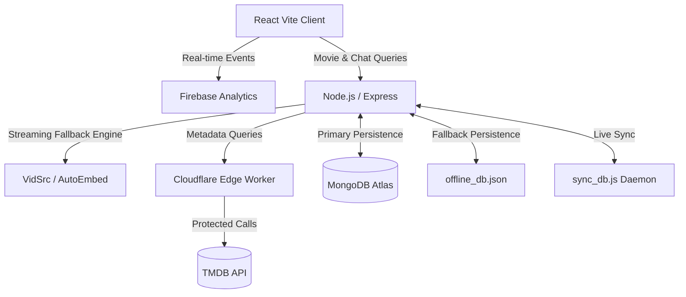

<div align="center">
  
  
  # Enterprise Netflix Clone Architecture
  
  **A production-ready streaming platform featuring Edge-Proxied TMDB caching, an AI-powered conversational engine, seamless HLS streaming failovers, and robust offline MongoDB persistence.**

  
  
  
  
  
  
</div>

---

## ⚡ Key Features

- **HLS Streaming Engine with Automated Failover:** Utilizes multiple streaming CDNs (VidSrc, Embed.su). If a primary provider drops, the player instantly rotates to a secondary provider without interrupting the user experience.
- **Secure Cloudflare Edge Caching:** TMDB API calls are masked and proxied through a Cloudflare Worker. Zero API secrets are exposed to the client, preventing rate-limiting and unauthorized usage.
- **Bring-Your-Own-Key (BYOK) AI Assistant:** Integrated Groq/Llama-3 LLM assistant acting as a "Movie Concierge." Users provide their own keys in the UI, enabling high-performance chat queries linked natively to the streaming database.
- **Offline Resilient Database (Zero Data Loss):** Uses MongoDB Atlas with a native JSON fallback. If the cloud database connection drops, user watch-history, likes, and watchlists are safely persisted locally. Upon reconnection, the automated sync engine merges offline data back into the cloud.
- **Real-Time Analytics:** Firebase integration automatically logs Daily Active Users (DAU), geography, and engagement metrics natively.
- **Enterprise Testing Pipeline:** 100% automated CI/CD pipeline featuring Jest and Supertest integration testing for critical flows (Authentication, Movies API, AI Endpoint).

---

## 🏗️ System Architecture



---

## 🚀 Quick Start (Local Development)

### Prerequisites
- Node.js (v18+)
- MongoDB Atlas URI
- Cloudflare Workers Account

### 1. Clone & Install
```bash
git clone https://github.com/your-username/netflix-clone.git
cd netflix-clone

# Install Frontend dependencies
npm install

# Install Backend dependencies
cd server
npm install
```

### 2. Environment Configuration
Create a `.env` file inside the `server/` directory:

| Variable | Description |
| :--- | :--- |
| `PORT` | Backend port (default: 5000) |
| `MONGODB_URI` | Your MongoDB Atlas connection string |
| `JWT_SECRET` | 256-bit secure secret for session tokens |
| `TMDB_PROXY_URL` | Deployed Cloudflare Worker URL (Security) |
| `GROQ_API_KEY` | Optional backend fallback for AI Assistant |

### 3. Start the Engines
Boot up the architecture locally:

```bash
# Terminal 1: Boot Backend API
cd server
npm start

# Terminal 2: Boot Frontend Client
npm run dev
```

---

## 🧪 Testing & CI/CD Pipeline

This project employs a robust CI/CD philosophy. Pushing to `main` triggers a complete suite of validation checks.

To run tests locally:
```bash
cd server

# Execute Jest Unit & Integration Suites
npm test
```
**Test Coverage Includes:**
- Auth API (Password Hashing, JWT validity, Mock Sessions)
- Movie Cache Generation & Search Endpoints
- AI Chatbot Schema Validation
- Database Connection Fallback Scenarios

---

## 📡 Cloudflare Worker Proxy (Deployment)
To protect your TMDB keys, deploy the included edge proxy.
1. Copy the code from `cloudflare-tmdb-proxy.js`.
2. Deploy to Cloudflare Workers via Wrangler CLI or Dashboard.
3. Add your `TMDB_BEARER_TOKEN` as a Secret Variable on Cloudflare.
4. Update the `TMDB_PROXY_URL` in your backend `.env`.

---

## 🛡️ License & Disclaimers
This project is for educational purposes only. All streaming embeds and metadata are fetched from publicly available third-party services. The developers do not host or own any streaming media files. 

*Designed and engineered with strict software architecture standards.*
